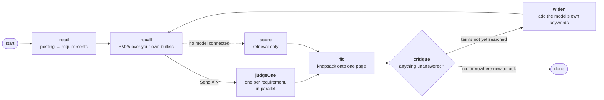

<div align="center">

# Resume Forge

**Write each bullet point once. Build a different résumé for every kind of job you apply to. Keep track of where you sent them.**

[**▸ Open Resume Forge**](https://resume-forge-blond.vercel.app) · [User guide](docs/guide.md) · [How it's built](docs/architecture.md)

Free · open source · no sign-up · nothing leaves your browser unless you connect your own AI model

</div>

<!--
  TODO: drop a screenshot of the Resume tab here, e.g.
  
  Don't use _preview_air-1.png — that's a real résumé with real contact details.
-->

---

## Architecture

The Tailor tab is the part worth reading code for. You paste a job posting; it returns a résumé
filled to **exactly one page** with the lines of your own history that answer it — and, more
usefully, the list of requirements that **nothing** in your history answers.

### The graph



Seven nodes, one loop. `critique → widen → recall` is what makes this an agent rather than a
pipeline: the first search uses the posting's own words, so the requirement it cannot answer is
precisely the one whose evidence is phrased differently everywhere in your library. The page that
comes out is checked back against the requirements that went in, and whatever is unanswered is
searched again with terms the model itself proposed. It goes round at most twice, and only when the
gap has keywords the previous round never searched — re-running the same query would return the same
rows and burn another fan-out to say so.

**The model ranks; it never packs.** Ask one to fill exactly one page and it agrees, confidently, at
1.3 pages, because nothing in a prompt can see a line break. `fit` is a knapsack with setup costs —
a bullet costs a line, but the first bullet of an entry drags in its heading and the first entry of a
section drags in the rule — against geometry re-derived from the same table the LaTeX preamble is
built from. It agrees with the whole-document estimate to 1e-6.

**It never drafts a bullet.** Every line on the page is one you wrote.

### Why the judge fans out, and why that is affordable

Scoring started as one call: every shortlisted line against every requirement, one row of output per
line. The judge has to hold a dozen rubrics at once, and has to emit sixty rows — so it drops some,
invisibly, because a missing row and a zero are the same thing downstream.

So `judge` is a LangGraph `Send` fan-out: one call per requirement, each asked only *which of these
lines are evidence for this one thing*. Output is a handful of rows instead of sixty, and an empty
list becomes a real answer rather than a malfunction.

That should cost N times as much. It nearly doesn't:

```
system  ── rubric + every shortlisted CV line ──  identical in all N calls  → cached
user    ── one requirement ──                     ~40 tokens, different each time
```

Every judge is handed the **whole** shortlist rather than the slice retrieved for its own
requirement. That is what keeps the prefix byte-identical, and it is better anyway — a judge can find
evidence BM25 ranked low for its requirement and high for someone else's. Anthropic caches that
prefix where the `cache_control` breakpoint marks it; OpenAI caches long prefixes unprompted. The
agent log prints the provider's own `cache_read` count, because otherwise this paragraph is a claim
rather than a measurement. Concurrency is capped — N simultaneous requests is a rate limit on a fresh
key and a stalled laptop on Ollama.

The property the whole cost argument rests on — that every judge sends the same prefix — is invisible
in the code. `lib/fanout.test.ts` asserts it directly.

### It is measured, not asserted

`lib/eval/` is an answer key: five postings' worth of requirements hand-labelled against a fixed
fifteen-line CV. Each requirement carries the lines that genuinely **are** evidence, and **traps** —
lines on the same topic that are not. Traps are the half that matters: a matcher that returns
everything on the right topic scores perfectly on recall and is useless.

Four metrics, micro-averaged over every labelled pair:

| | what it asks |
|---|---|
| **shortlist** | did retrieval put the evidence in front of the judges at all — the ceiling on everything else |
| **recall** | of the lines that are evidence, how many were credited |
| **precision** | of the lines credited, how many the key agrees with |
| **traps** | of the predicted over-claims, how many were made *(lower is better)* |

Retrieval mode needs no key and takes a fifth of a second, so it runs in `npm test` on every commit.
`npm run eval` prints it in full; `EVAL_MODEL=… npm run eval` runs the same key through a provider.

```
case               shortlist    recall   precis.     traps      gaps
ml-inference            100%       56%       56%        0%      100%
frontend                100%       67%      100%        0%      100%
hardware                100%       75%       75%        0%      100%
vocabulary-gap          100%        0%        —         0%        0%
off-domain                —         —         —         —       100%
total                   100%       55%       71%        0%       88%
```

**The first thing it did was overturn a constant.** The threshold deciding whether a line counts as
evidence was 0.14 — but only after the harness existed. It had been 0.2, set because it looked about
right against two postings tried by hand:

```
STRONG   recall   precision   traps   gap calls
 0.08      86%        51%       0%       100%
 0.10      77%        57%       0%       100%
 0.12      68%        60%       0%       100%
 0.14      55%        71%       0%        88%
 0.20      50%        69%       0%        82%      ← what it used to be
```

0.2 loses to 0.14 on **all four columns at once**. It was not a precision/recall trade; it was just
too strict, and nothing before this could tell an improvement from a regression.

Two other things the report says. **Retrieval is not the bottleneck** — every labelled line reaches
the judges, which is the argument against reaching for embeddings over a corpus this size.
And **`vocabulary-gap` scores zero and stays in the report**: it is the case where the posting and the
CV describe the same work in different words, and the test asserts it *keeps* failing. Deleting it
would raise the average and hide the one thing a model is actually for.

### The trust boundary

A job posting is pasted from a job board. Nobody reads all of it, and it goes straight into a prompt,
which makes it the one genuinely untrusted input here. The prize for an attacker is not exfiltration
— the model calls no tools and its whole output is `(line id, score)` pairs from a fixed corpus — it
is **the scores**: talk a judge into crediting everything and the honest gap report becomes a lie.

Postings are stripped of invisible characters and fenced with a per-run nonce, and anything that
reads like an instruction is reported to *you* rather than quietly cleaned up. But the defences that
actually hold are structural: a requirement is bounded to 120 characters and ten single-word terms
before it can reach a judge, and a judge that calls more than half your CV direct evidence for one
requirement is disbelieved and replaced with lexical scoring, which cannot be talked into anything.
`lib/injection.test.ts` runs a hostile posting through the real graph against a model that obeys it
completely — testing against one that resists would measure the model, not this code.

### The rest

- `lib/retrieve.ts` — BM25 with an alias pass over your own bullets. No embeddings: a few hundred
  short documents written by one person is the size where lexical search wins outright, and your tag
  vocabulary is hand-built supervision no embedding model has.
- `lib/llm.ts` — Claude, ChatGPT, Ollama, or any OpenAI-compatible server, called straight from the
  browser with your own key. Model lists are fetched from the provider rather than hardcoded.
- **233 tests**, typecheck and build in CI.

Longer version, including what is deliberately *not* built: **[docs/architecture.md](docs/architecture.md)**.

---

## The problem

Most job hunts end up with three or four résumé files that slowly drift apart. You fix a typo in one
and forget the others. You tailor one for a hardware role, then six weeks later you can't remember
what it says that the machine-learning one doesn't. And when a company finally emails back, you have
no idea which version they actually read.

Resume Forge keeps **one library of everything you have ever done**, and treats each résumé as
nothing more than a set of tick-boxes over that library. Fix a typo once and it's fixed everywhere.

---

## What you get

**One library, many résumés.** Write a bullet point once. Tick it into whichever résumés should
carry it. There is only ever one copy of the text.

**Real, professional PDF output.** The app writes LaTeX — the typesetting system most engineering
and academic résumés are built with. *You do not need to know LaTeX.* You press a button and it
either downloads a file or opens in [Overleaf](https://www.overleaf.com), a free website that turns
that file into a PDF. (There's also a plain "Print / Save PDF" if you'd rather not bother.)

**A page counter that doesn't lie.** The live preview is measured against real LaTeX output, so when
it says `0.94 / 1` your résumé genuinely fits on one page, and `1.03 / 1` genuinely spills onto two.

**An application tracker.** Paste a job link; the company name, the role and the application system
are read out of the URL. Every row remembers **which résumé you sent** — a frozen copy is taken
automatically the moment an application leaves "saved", so months later you can still see exactly
what that company received.

**A practice tracker.** LeetCode, NeetCode, Deep-ML, HDLBits, or anything else you add. It
cross-references what you've practised against the topics on the jobs you've actually applied to,
so you can see what you're weakest on where it counts.

**One page, tailored to one posting.** Paste a job description on the Tailor tab. It reads what the
role asks for, searches your bullet library for the lines that answer it, and fills exactly one page
with them — then shows its working: which of your bullets answers which requirement, and which
requirements **nothing** in your library answers. That last list is the useful one. It never writes
a bullet for you; every line on the page is one you wrote.

This works with no setup at all, matching on keywords. Connect a model — Claude, ChatGPT, or an open
model running on your own machine through Ollama — and it matches on meaning instead. Your key, your
account, straight from your browser; see the FAQ for exactly what gets sent.

**Your data stays yours.** Everything lives on your own computer. No account, no server, no company
holding your job hunt. Export the whole thing as one file whenever you like.

---

## Five minutes to your first résumé

1. **[Open the app](https://resume-forge-blond.vercel.app).** You'll land on a made-up candidate's data —
   that's just so the screens aren't blank. Nothing is saved anywhere but your own browser.

2. **Go to the Data tab and set up a backup file first.** Press `Choose a backup file` and save it
   somewhere that syncs — iCloud Drive, Dropbox, OneDrive, Google Drive. From then on every edit is
   written to that file a second later, so your browser is never the only copy. *(This needs Chrome
   or Edge. On Safari or Firefox, use `Export JSON` regularly instead — the app will remind you.)*

3. **Put your own details in.** Still on the Data tab: your name, email, phone, links.

4. **Replace the demo content.** Two ways:
   - *Already have a résumé?* Use **Import a résumé** on the Data tab — drop in your existing PDF
     or `.tex` file and it pulls out the entries and bullets for you.
   - *Starting fresh?* Go to the Resume tab and edit the demo entries directly, or delete them and
     add your own.

5. **Tick the bullets you want** and watch the preview on the right. Keep trimming until the page
   counter goes blue.

6. **Export.** `Download .tex` and upload it to Overleaf, or press `Open in Overleaf` to skip a
   step. It compiles as-is.

Then, when you want a second résumé for a different kind of role: duplicate the variant, untick what
doesn't apply, tick what does. It costs you a minute, not an afternoon.

---

## Where your data is kept

There is no server and no database. Everything is held by your browser, on your machine.

**Closing the tab does not lose your work, and neither does shutting down.** Browser storage is
written to disk, not held in memory. Close the tab, quit the browser, restart the laptop, run the
battery flat mid-sentence — it is all still there when you come back. Every change is saved the
instant you make it; there is no "save" button because there is nothing to press.

What *does* lose it: clearing your browsing data, using a private/incognito window, or leaving it
untouched for a week in Safari on an iPhone. And a laptop that gets lost or stolen takes its copy
with it.

That's private, but browser storage is **not a backup** — it's tied to one exact web address, and
clearing your browsing data takes it with it. So the app gives you three ways to keep a real copy:

| | How | Good for |
|---|---|---|
| **Backup file** *(recommended)* | Data tab → `Choose a backup file`. Every edit is written to it automatically. | Everyday use. Chrome and Edge only. |
| **Export JSON** | Data tab → `Export JSON`. One file with everything in it. | Safari and Firefox, or moving to a new computer. |
| **Restore points** | Taken automatically before anything destructive. Last 12 kept. | Undoing a mistake you made an hour ago. |

**Putting that backup file in a synced folder is also how you use Resume Forge on two computers.**
Point both at the same file. When they disagree, the app **stops and asks you** which side to keep,
showing how many entries and applications each one has. It will never quietly merge them and it will
never pick for you — that's the only way to be sure nothing gets silently lost.

**Undo works everywhere.** ⌘Z / Ctrl+Z, or the ↺ button in the header. ⇧⌘Z redoes. Sixty steps of
history, per session.

---

## On your phone

Right now Resume Forge is built for a laptop, and the phone experience is honest about that: you can
open it and read things, but the two-pane editor is cramped and there is no automatic backup file,
because phone browsers don't support that feature.

**If you use it on a phone, export a JSON file before you close the tab.** Especially on iPhone —
iOS deletes a website's stored data after seven days of not visiting it.

Making the phone a real, safe place to log applications is the next big piece of work; the plan is
written up in [docs/architecture.md](docs/architecture.md).

---

## Questions people ask

**Do I need to know LaTeX?** No. You never see it unless you go looking. Press `Open in Overleaf`
and you get a PDF.

**Is my résumé uploaded anywhere?** Not unless you ask for it. By default the app makes one outbound
request in its whole life, and only if you press `Sync catalogue` on the Practice tab — that fetches
Deep-ML's public list of exercises and sends nothing about you.

The one exception is the Tailor tab, and only after you have connected a model and switched it on.
Then two things are sent to the provider *you* chose, with *your* key, straight from your browser:
the job description you pasted, and the résumé lines the search shortlisted. Never your applications,
your notes, who referred you, or your contact details. Your key is kept apart from your résumé data,
so it is not in any export, backup file or restore point. Pick Ollama instead and nothing leaves your
machine at all. Leave the tab alone and it behaves exactly as it did before: keyword matching, no
network.

**Can I share the link with a friend?** Yes, and that's safe. They get their own empty copy in their
own browser. They cannot see anything of yours.

**What if I clear my browser data?** Everything is gone unless you set up the backup file or exported
a JSON. Please do step 2 above.

**Can I use this for a non-technical résumé?** Yes. Nothing about the data model is engineering-
specific; the LaTeX template is a fairly classic one-column-with-dates layout.

**Chinese / CJK résumés?** The default template can't typeset Chinese. There's a two-line fix in the
[user guide](docs/guide.md#a-chinese-résumé).

**Something went wrong and my data looks empty.** Don't panic and don't start retyping — see
[Troubleshooting](#troubleshooting).

---

## Troubleshooting

**"I opened the app and everything is gone."**
Almost always this means you're at a slightly different web address than last time. Browser storage
is tied to the exact address, down to the number after the colon. If you normally use
`localhost:3000` and today it opened on `localhost:3001`, the app is looking in a different drawer —
your data is still in the other one. Close whatever else is using port 3000 and reopen it there. This
is the single best reason to use the hosted link, whose address never moves.

**"The header says `backup paused`."**
Your backup file and this browser disagree — usually because another computer edited it. Go to the
Data tab and pick which side to keep. Nothing is lost until you choose.

**"The header says `backup locked`."**
The browser dropped permission to write the file, which happens after a restart. Data tab →
reconnect. One click.

**"`Sync catalogue` on the Practice tab does nothing."**
Deep-ML's server is unreachable or slow. It's the only external service the app touches and
everything else keeps working without it.

---

## Run it on your own computer

You don't need to — [the hosted version](https://resume-forge-blond.vercel.app) is the same app and your
data still stays on your machine. This is for people who want to change the code.

You'll need [Node.js](https://nodejs.org) 20 or newer.

```bash
git clone https://github.com/HahhaNa/Resume-Forge.git
```

```bash
cd Resume-Forge && npm install
```

```bash
npm run dev
```

Then open <http://localhost:3000>.

> **Watch the port.** If something else is already using 3000, Next.js quietly starts on 3001 — and
> because browser storage is per-address, the app will look empty. Use `npm run dev -- -p 3000` and
> fix the conflict rather than accepting the new port, or just connect a backup file so it doesn't
> matter.

### Deploy your own copy

Push the repo to GitHub, go to [vercel.com](https://vercel.com), click *Import Project*, and accept
every default. There are no environment variables, no database, and nothing to configure. Or from
the terminal:

```bash
npx vercel --prod
```

---

## How it's built

Next.js 15 (App Router) · TypeScript · Tailwind · Zustand · LangChain + LangGraph for the tailoring
agent, with an answer key under `lib/eval/` that `npm test` scores it against. About 13k lines. The only server-side file in the whole repo is a 60-line read-only proxy for
Deep-ML's public catalogue — the model clients run in your browser, which is why there is still
nowhere for us to hold a key or read a résumé.

- **[docs/guide.md](docs/guide.md)** — what every tab does, in detail. Read this if you're using the app seriously.
- **[docs/architecture.md](docs/architecture.md)** — the data model, why there's no backend, and the plan for mobile and sync.

```
app/        one folder per tab, plus api/deepml/ (the only server code)
components/ AppShell, the resume preview, entry editor, shared UI
lib/        types, store, resolve() → LaTeX, backup, import, i18n, seed data
lib/*.test.ts  the pure half, under test — run with npm test
```

`lib/resume.ts`'s `resolve()` is the single source of truth: the on-screen preview and the exported
LaTeX both read from it, so what you see is what compiles.

## Contributing

Issues and pull requests are welcome. Good first areas: résumé templates beyond the default one,
importers for other formats, more job-board URL patterns in `lib/ats.ts`, and translations
(strings live in `lib/i18n.ts`).

Before you open a PR:

```bash
npm run typecheck && npm test
```

The tests cover `lib/` — LaTeX generation, résumé import, dates, variant rules, and the schema
migration. They run in a couple of hundred milliseconds, so `npm run test:watch` while you work is
comfortable. The same two commands plus `npm run build` run in CI on every push.

## License

MIT — see [LICENSE](LICENSE). The bundled XCharter webfonts in `public/fonts/` have their own
licence, in `public/fonts/LICENSE.txt`.
