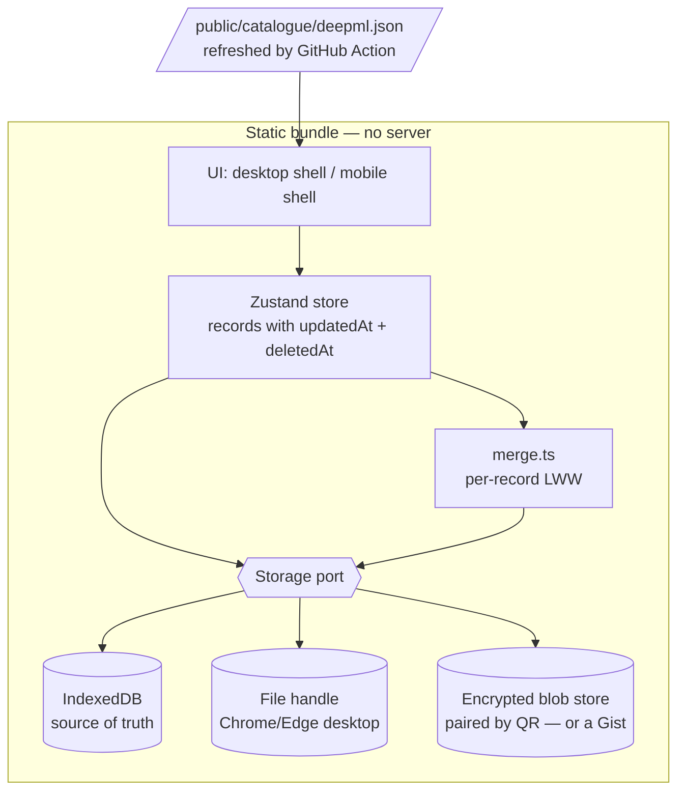

# Architecture

How Resume Forge is put together today, why it has no backend, and what has to change for it to be
as good on a phone as it is on a laptop.

- [The principle](#the-principle)
- [What exists today](#what-exists-today)
- [What is actually wrong](#what-is-actually-wrong)
- [Is a backend hard?](#is-a-backend-hard)
- [The target design](#the-target-design)
  - [1. Delete the server](#1-delete-the-server)
  - [2. One storage port, three adapters](#2-one-storage-port-three-adapters)
  - [3. Make records mergeable](#3-make-records-mergeable)
  - [4. Sync](#4-sync)
  - [5. Mobile is a different app shape](#5-mobile-is-a-different-app-shape)
- [Roadmap](#roadmap)
- [Decisions we are deliberately not taking](#decisions-we-are-deliberately-not-taking)

---

## The principle

Two goals, and they pull against each other:

1. **Work must never be lost.** Someone spends an evening tuning a résumé onto one page. That has to
   survive a closed tab, a flat battery, a new laptop, and a clumsy click.
2. **Nobody should have to trust us with their job hunt.** Which companies you are talking to, who
   referred you, what you wrote about being rejected — a tool that holds all of that on someone
   else's database is a worse product, not a more capable one.

Durability wants copies everywhere; privacy wants copies nowhere but yours. The line this project
draws between them is **not "no servers"** — it is:

> A server may exist. It may never hold anything it can read, and it may never be required to use
> the app.

That permits a great deal, including proper phone↔laptop sync. It rules out exactly one thing:
accounts on a database we operate. [Is a backend hard?](#is-a-backend-hard) works through why.

---

## What exists today

```mermaid
flowchart LR
  subgraph Browser
    UI[React tabs] --> Z[Zustand store]
    Z --> LS[(localStorage<br/>one JSON blob)]
    Z --> BK[backup.ts]
    BK --> FH[(File System Access<br/>handle in IndexedDB)]
  end
  FH -.->|written every 1s| F[/resume-forge.json<br/>in iCloud or Dropbox/]
  F -.->|read on launch| BK
  UI -->|only on 'Sync catalogue'| PX[/api/deepml]
  PX --> DM[(Deep-ML public API)]
```

| Piece | Where | Notes |
|---|---|---|
| Source of truth | `lib/store.ts` → Zustand + `persist` | One `DB` object, `localStorage["resume-forge"]`, schema v2 |
| Derived output | `lib/resume.ts` `resolve(db, variant)` | Preview and LaTeX both read this — they cannot disagree |
| Durability | `lib/backup.ts` | Whole blob written to a user-picked file, 1s debounce; handle in IndexedDB |
| Sync | The file, in a cloud-synced folder | Desktop ↔ desktop only |
| Conflict | Halt and ask | Never merges, never guesses |
| Server | `app/api/deepml/route.ts` | 60 lines, read-only, no state, no key |

That is the whole system. It is genuinely small, and the small size is worth defending.

---

## What is actually wrong

Five things, roughly in order of how much they hurt.

**1. On a phone, data can just vanish.** Phone browsers have no File System Access API, so
`localStorage` is the *only* copy. iOS then deletes a site's script-writable storage after seven days
without a visit. Someone who logs ten applications from the train and comes back a fortnight later
finds nothing. This is silent, it looks like a bug in us, and it is currently unmitigated.

**2. One API route costs the whole static story.** `app/api/deepml/route.ts` is the only reason this
project needs a Node runtime at all. Because it exists, the app cannot be built with
`output: "export"`, which means it cannot go on GitHub Pages, cannot be dropped on any static host,
and cannot be self-hosted by anyone who isn't comfortable running a Node process. The route earns
none of that: it forwards four fixed public URLs.

**3. `localStorage` is the wrong substrate.** It is synchronous, capped around 5 MB per origin, and
the `persist` middleware re-serialises the *entire* database on every change. Application snapshots
each hold a full `.tex` (~10 KB); a hundred applications is a megabyte before you count anything
else. It is also the first thing a browser throws away under pressure.

**4. Halt-on-conflict does not survive a third device.** Two desktops that take turns are fine. Add a
phone and the normal case becomes "phone added an application, laptop edited a bullet" — genuinely
concurrent, genuinely non-overlapping, and the app stops and makes you throw one side away. The
current behaviour is right for a whole-file blob; the blob is the problem.

**5. The mobile layout is a shrunk desktop.** There are about eighteen responsive utilities across
~3,800 lines of page code. `app/page.tsx` collapses `lg:grid-cols-[1.28fr_minmax(430px,1fr)]` into a
stack, which is a fallback, not a design.

Note what is *not* on this list: the data model, `resolve()`, the import pipeline, the ATS URL
parser, the undo system. Those are good and should not be touched.

---

## Is a backend hard?

### First, what actually survives what

Worth stating precisely, because the intuition is usually wrong in both directions.
`localStorage` is on disk, not in memory. Today, with no backup file connected at all:

| | Survives? |
|---|---|
| Close the tab | ✅ |
| Quit the browser | ✅ |
| Restart or shut down the machine | ✅ |
| Battery dies mid-edit | ✅ — every change is written immediately |
| Browser crashes | ✅ |
| Open it on `:3001` instead of `:3000` | ⚠️ looks empty, **nothing is lost** — it is in the other origin's storage |
| "Clear browsing data" including site data | ❌ gone |
| Private / incognito window | ❌ gone on close |
| iOS Safari, seven days without a visit | ❌ gone |
| A different browser, or a different machine | ⚠️ that is a separate copy, not the same one |

So the frightening scenario — spend an evening on it, shut the laptop, come back to nothing — **does
not happen today.** The genuine losses are a deliberate cache clear, incognito, and the iOS timer.
The one that *feels* like catastrophe and is not is the port change, which is why it earned a
section in the README.

None of that makes the current setup good enough. Three of those rows should not be ❌ or ⚠️, and one
copy on one machine is one hard-disk failure from zero. But it does mean this is a **durability
gap to close deliberately**, not a fire.

### Two things get called "a backend"

They differ by roughly two orders of magnitude in what they cost you.

#### The kind with accounts — Supabase, Firebase, your own Postgres + auth

**Building it is not that hard.** Supabase hands you auth, a table and row-level security. Someone
who has never done backend work, with an AI assistant, has a working happy path in two or three days.

**Owning it is hard, and it never stops.** You become the custodian of other people's interview
pipelines — who they are talking to, who referred them, what they wrote after a rejection — with the
breach and deletion-request obligations that implies. Free tiers run out and someone has to pay.
Password resets need deliverable email. Accounts get locked and spam signups arrive. And on the day
you lose interest in the project, everyone's data is stranded behind a login only you can operate.

Then the part that matters most for your actual question: **every person who forks this repo would
have to provision their own Supabase project and set environment variables before the app would run
at all.** Adding this kind of backend does not fix "the backend is hard to set up" — it is the thing
that would finally make that sentence true. Today the setup burden is one 60-line file that
[phase 0](#roadmap) deletes.

**Verdict: no.** The cost is ongoing and mostly non-technical, and the benefit — durability — is
available for far less.

#### The kind with no accounts — a dumb encrypted box

The entire server:

```
PUT /:id    store these bytes
GET /:id    give them back
```

No login. No user table. No schema. It cannot read what it holds, because the browser encrypts
before sending and decrypts after fetching; to the server it is noise.

How it feels to use: on the laptop, press **Sync to my phone**. The app generates a random sync
code, derives a key from it, and shows a QR code. Point the phone at it. That is the whole setup —
no email, no password, no account, nothing to remember.

Honest effort:

| Piece | What it actually is | Time |
|---|---|---|
| The server | A Cloudflare Worker + KV. `npx wrangler init`, ~80 lines, `npx wrangler deploy` | an afternoon |
| Encryption | WebCrypto — PBKDF2 to turn the sync code into a key, AES-GCM to seal the blob. ~60 lines | a day, mostly reading |
| Pairing | QR out, camera in | a day |
| Merge | `lib/merge.ts` — required for *any* sync, see [§3](#3-make-records-mergeable) | two days |

**Running cost: zero.** Cloudflare's free tier is 100,000 requests a day and this app makes a
handful per session. Nothing to keep alive, no OS to patch, no migrations, no backups to take —
if the Worker vanished tomorrow every user's data would still be in their browser and their backup
file, because sync is a convenience layer and never the source of truth. That property is what makes
the whole thing cheap to own.

**Verdict: yes**, once phone↔laptop sync is the priority. It is about a week, not a project.

### The thing worth holding on to

The fear is losing work. **A backend does not fix that — a second copy does.** A server is one way
to hold a second copy, and for a phone it is the most practical one. But it is not the fastest fix,
it is not the fix to reach for first, and the account-shaped version would make the project harder
to use rather than safer.

| What you are afraid of | What actually fixes it | Cost |
|---|---|---|
| Closing the tab / shutting down | Already fine | — |
| Clearing browsing data by accident | The backup file, made non-optional | an afternoon |
| Laptop dies / gets stolen | Backup file in a synced folder | already built |
| Phone data evaporating after a week | Installable PWA + IndexedDB | a weekend |
| Editing on the phone and the laptop | Mergeable records, then sync | ~a week |

Only the last row needs a server at all.

---

## The target design



### 1. Delete the server

Replace the live proxy with a build-time artefact.

- A scheduled GitHub Action (weekly) fetches Deep-ML's four catalogues, writes
  `public/catalogue/deepml.json`, and opens a commit if it changed.
- `lib/deepml.ts` gains a third tier in front of the two it already has: **static file → direct fetch
  (refresh, works on `localhost:3000` where their CORS allows it) → nothing**. Delete `PROXY`.
- `next.config.mjs` gets `output: "export"`, `images: { unoptimized: true }`.
- Add `.github/workflows/pages.yml`. Deploy on push to `main`.

What this buys, all at once:

| | Before | After |
|---|---|---|
| Hosting | Vercel, or Node somewhere | Any static host, incl. GitHub Pages |
| Self-host difficulty | `npm install && npm run build && npm start`, keep a process alive | Copy a folder |
| `Sync catalogue` | ~40 requests fanned out, several seconds | One file, already cached |
| Offline | Fails | Works |
| Catalogue freshness | Live | Up to a week stale — irrelevant for a problem list |

Server-side code in the repo after this: **zero files.** That is the honest answer to "the backend is
hard to set up" — there stops being one.

### 2. One storage port, three adapters

Introduce `lib/storage/port.ts`:

```ts
export interface StoragePort {
  id: "idb" | "file" | "gist" | "drive";
  load(): Promise<DB | null>;
  save(db: DB): Promise<void>;
  /** null when the remote cannot tell us cheaply */
  remoteStamp(): Promise<string | null>;
}
```

- **`idb`** — IndexedDB via `idb-keyval` (~600 bytes), replacing `localStorage` as the source of
  truth. Async, effectively unbounded, and pairs with `navigator.storage.persist()` to ask the
  browser not to evict us. Migrate on first load: if `localStorage["resume-forge"]` exists, read it,
  write it to IDB, leave the old key alone for one release.
- **`file`** — today's `backup.ts`, unchanged behaviour, now just one adapter among several.
- **`gist` / `drive`** — see §4.

`backup.ts`'s state machine (`on / off / locked / conflict / error`) generalises to the port and the
header badge keeps working as-is.

**Then make the unsafe state visible.** If the platform has no `file` adapter, no remote is
connected, and the app is not installed to the home screen, that is the vanishing-data case from
above. Say so, once, in plain language, with the two buttons that fix it (Install, or Export).

Add a PWA manifest and a service worker (`next-pwa`, or ~30 lines by hand since the bundle is
static). Installing is not cosmetic here: **an iOS home-screen web app is exempt from the seven-day
storage cap.** It is the cheapest durability fix available and it needs no backend.

### 3. Make records mergeable

Schema v3. Every record in `DB` — entries, bullets, variants, applications, platforms, solves, tags —
gains two fields:

```ts
interface Tracked {
  updatedAt: number;   // Date.now() on every mutation
  deletedAt?: number;  // tombstone; kept ~90 days, then swept
}
```

The store already funnels every mutation through a small number of setters, so stamping is a handful
of lines, not a rewrite. Deletes become tombstones so that "deleted on the laptop" can beat "still
present in the phone's copy" — without tombstones, every sync resurrects everything you removed.

`lib/merge.ts` is then about forty lines: walk both sides by id, keep the higher `updatedAt`, let a
tombstone win over an older edit. Order-bearing fields (a variant's section order) are single
last-write-wins values on the variant record, not merged element-wise.

The conflict UI changes from *"pick a side, lose the other"* to *"merged; 3 things from this device
were superseded — Undo"*. The restore-point machinery already in `lib/store.ts` is exactly the safety
net that makes automatic merging acceptable.

> **Why not CRDTs?** Automerge or Yjs would preserve two people editing the same sentence at the same
> moment. That is the wrong problem: this is a single-user tool across two of their own devices, and
> the realistic conflict is "different records", which per-record LWW handles perfectly. The cost —
> a new dependency, a binary document format, a parallel data model, and a much harder debugging
> story — buys us a case that will occur approximately never. Revisit only if collaboration
> (a mentor editing your résumé) ever becomes a goal.

### 4. Sync

The file-in-a-synced-folder approach stays, and stays the recommendation on desktop. It just cannot
reach a phone: iCloud Drive and Dropbox do not hand a writable file handle to a web page, and mobile
browsers have no picker to give one. So the phone needs a remote.

| Option | Setup the user does | Works on | Verdict |
|---|---|---|---|
| **Encrypted blob store + sync code** | Scan a QR code | Everywhere | **Ship this.** No account, server holds ciphertext, ~a week to build, free to run |
| Private GitHub Gist | Paste a fine-grained PAT | Everywhere | **Good developer-facing alternative**, and needs no server of ours at all. Token pasting is too much for a non-technical user, so this is the second option, not the first |
| Dropbox / Google Drive app folder | OAuth, in-browser | Everywhere | Viable; more moving parts (register an app), and it puts a third party in the loop |
| WebRTC / P2P | none | Both devices awake at once | Rejected — needs a signalling server anyway, and the devices rarely are |
| Hosted DB with accounts | Sign up | Everywhere | Rejected — see [above](#the-kind-with-accounts--supabase-firebase-your-own-postgres--auth) |

**The blob store, concretely.** `sync/` in this repo holds a Cloudflare Worker with two routes and a
KV namespace. The client:

1. generates a 128-bit sync code, rendered as a QR and as words for typing;
2. derives an AES-GCM key from it with PBKDF2, and derives the storage id as a *separate* hash of
   the same code — so the id the server sees never reveals the key;
3. `PUT`s the encrypted `DB` on a debounce, `GET`s and merges on launch and on focus.

The server sees an opaque id and a blob of ciphertext. It has no idea whose it is, what is in it, or
that a résumé is involved. Blobs expire after 90 days untouched, which is the whole of the retention
policy.

Anyone uncomfortable with even that runs `npx wrangler deploy` on their own account and changes one
URL — or uses the Gist adapter and has no server in the picture whatsoever.

**Two things to get right:**

- **Sync is never the source of truth.** The local IndexedDB copy is. If the Worker is down the app
  keeps working and syncs later. Nothing in the UI should ever block on the network.
- **Losing the sync code means losing the ciphertext**, because there is deliberately no recovery
  path — that is what "we cannot read it" means. Say so at the moment the code is created, and push
  the user to keep the backup file as well.

### 5. Mobile is a different app shape

Do not responsive-ify the desktop editor. What you do on a phone is not a subset of what you do on a
laptop — it is a different activity.

| | Laptop | Phone |
|---|---|---|
| Write and edit bullets | ✓ the main event | ✗ read-only, "open on a laptop to edit" |
| Tune density, compare variants | ✓ | ✗ |
| Export LaTeX / Overleaf | ✓ | share the PDF or plain text |
| **Log an application you just saw** | ✓ | **✓ the main event** |
| Tick off a practice problem | ✓ | ✓ |
| Check the funnel / review queue | ✓ | ✓ |

So: a mobile shell with a bottom tab bar and three destinations — **Apply**, **Practice**,
**Résumé** (read-only, with a share button). One breakpoint, chosen by container width, not user
agent. The Library matrix and the density controls simply are not there, and the app says why rather
than rendering them badly.

**The feature that makes this worth doing: a Web Share Target.** Once the PWA is installed, register
it in the manifest as a share target for URLs. Then sharing a Greenhouse link from the LinkedIn app
opens Resume Forge with the company, role and ATS already filled in by `lib/ats.ts`. Job spotted to
job logged, four seconds, no typing. That is a demo people screenshot.

Chromium on Android only — iOS does not implement `share_target`. The iOS path is paste-into-quick-add
(which already works) plus, optionally, a published Shortcuts action. Say which is which in the docs
rather than letting an iPhone user wonder why the blog post lied.

---

## Roadmap

Ordered so each phase is shippable on its own and the risky data change lands before there are users
to break.

| Phase | Work | Why now |
|---|---|---|
| **Now** · an afternoon | Make the backup file **non-optional**: offer it on first run, keep a coloured warning in the header until *something* holds a second copy, and stop being quiet about a week with no export | Uses code that already exists, and closes both genuine desktop loss cases today |
| **0** · a weekend | Catalogue → static JSON + weekly Action · `output: "export"` · GitHub Pages workflow · README leads with the hosted link | Removes the setup problem entirely; unblocks every static host |
| **1** · a weekend | Storage port · IndexedDB as source of truth · `storage.persist()` · PWA manifest + service worker · name the unsafe combination out loud | The iOS seven-day case is live right now and completely silent |
| **2** · ~2 days | Schema v3 timestamps + tombstones · `lib/merge.ts` · file backup merges instead of halting | Must precede any sync, and the migration is cheap now and expensive once there are users |
| **3** · ~1 week | Bottom-nav mobile layout · read-only résumé view · share-sheet export · Web Share Target | The phone becomes genuinely useful, not merely survivable |
| **4** · ~1 week | Worker + KV · WebCrypto seal/open · QR pairing · debounced push, merge on focus. Gist adapter alongside, for people who would rather have no server at all | Phone ↔ laptop, with nothing readable leaving the browser |
| **5** · later | Drive adapter · more résumé templates · a proper docs site | Nice to have, never required |

**Now** is worth doing before anything else on this list: it is a few hours, it needs no new
concepts, and it converts the feature that already exists from something you have to know about into
something the app insists on. Phase 2 is the one to be careful with — write the migration test first.

### For the project's reach

Phase 0 is also the growth work, which is not a coincidence. The thing that makes a repo spread is a
link that works in three seconds on a stranger's phone, and a screenshot above the fold. After that:
a short GIF of ticking bullets and watching the page counter go blue, repo topics, a handful of
`good first issue`s (new templates, more ATS URL patterns in `lib/ats.ts`, translations in
`lib/i18n.ts`), and a `CONTRIBUTING.md`.

---

## Decisions we are deliberately not taking

- **No accounts, and no database that can read what it stores.** A server is allowed; a server that
  could open your applications and read who rejected you is not. Everything else here bends around
  that one line.
- **Sync is never the source of truth.** The local copy is, always. Every remote in this document is
  a convenience that can disappear without costing anyone their data — which is also why none of
  them need an SLA, a backup policy, or an on-call rota.
- **No server-side LaTeX compilation.** Overleaf already does this better and for free, and a
  compile farm is the one feature that would force us to run infrastructure.
- **No CRDT.** See §3.
- **No React Native / native app.** An installed PWA covers the mobile cases above; a second codebase
  does not pay for itself.
- **No telemetry.** Not even anonymous. It would be the first thing that leaves the browser, and the
  README's promise that nothing does is worth more than the numbers.

---

## Repository layout

```
app/
  page.tsx              resume builder
  library/page.tsx      entry × variant matrix
  applications/page.tsx application tracker
  practice/page.tsx     multi-platform practice tracker
  data/page.tsx         profile, tags, backup file, import/export
  api/deepml/route.ts   the only server code — removed in phase 0
components/
  AppShell.tsx          nav, language toggle, theme toggle
  resume/Preview.tsx    page-accurate live preview
  resume/EntryModal.tsx entry fields + which variants carry it
  resume/CompareVariants.tsx  variant diff
  ui/bits.tsx           shared inputs, bars, modal
lib/
  *.test.ts             vitest, node environment — the pure modules below
  migrate.ts            persisted state from an older release, brought up to date
  types.ts              the whole data model
  library.ts            entry ↔ variant rules: which section, what order, which bullets
  store.ts              zustand store, persisted
  backup.ts             continuous write to a user-picked file; handle in IndexedDB
  resume.ts             resolve(db, variant) -> LaTeX and preview
  import.ts             PDF / LaTeX résumé import
  ats.ts                job-board URL -> company, portal, role
  deepml.ts             Deep-ML catalogues: fetch, cache, search, link → ref
  seed.ts               starter content
  i18n.ts               EN / ZH strings
```
