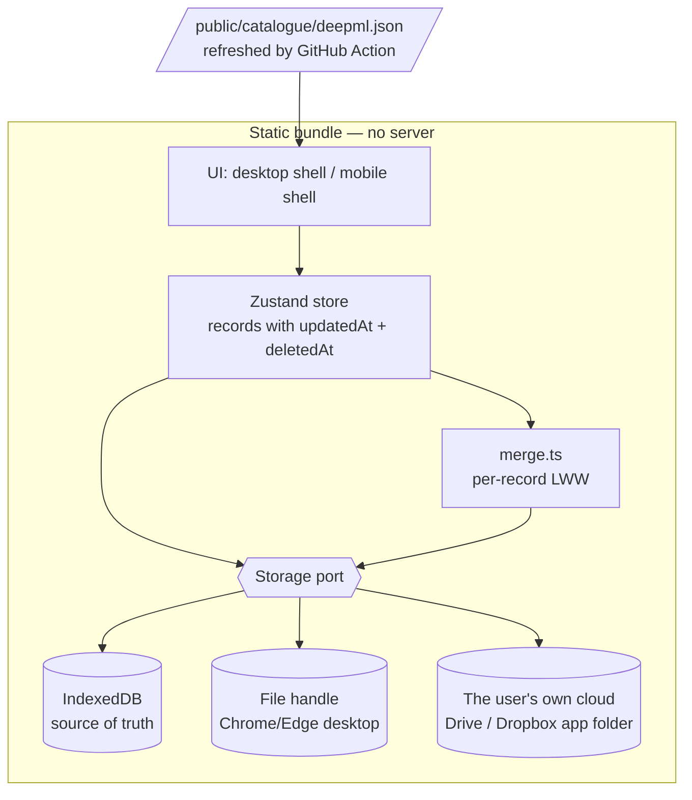

# Architecture

How Resume Forge is put together today, why it has no backend, and what has to change for it to be
as good on a phone as it is on a laptop.

- [The principle](#the-principle)
- [What exists today](#what-exists-today)
- [What is actually wrong](#what-is-actually-wrong)
- [Is a backend hard?](#is-a-backend-hard)
- [The target design](#the-target-design)
  - [1. Delete the server](#1-delete-the-server)
  - [2. One storage port, three adapters](#2-one-storage-port-three-adapters)
  - [3. Make records mergeable](#3-make-records-mergeable)
  - [4. Sync](#4-sync)
  - [5. Mobile is a different app shape](#5-mobile-is-a-different-app-shape)
- [Roadmap](#roadmap)
- [Decisions we are deliberately not taking](#decisions-we-are-deliberately-not-taking)

---

## The principle

Two goals, and they pull against each other:

1. **Work must never be lost.** Someone spends an evening tuning a résumé onto one page. That has to
   survive a closed tab, a flat battery, a new laptop, and a clumsy click.
2. **Nobody should have to trust us with their job hunt.** Which companies you are talking to, who
   referred you, what you wrote about being rejected — a tool that holds all of that on someone
   else's database is a worse product, not a more capable one.

Durability wants copies everywhere; privacy wants copies nowhere but yours. The line this project
draws between them is **not "no servers"** — it is:

> A server may exist. It may never hold anything it can read, and it may never be required to use
> the app.

That permits a great deal, including proper phone↔laptop sync. It rules out exactly one thing:
accounts on a database we operate. [Is a backend hard?](#is-a-backend-hard) works through why.

---

## What exists today

```mermaid
flowchart LR
  subgraph Browser
    UI[React tabs] --> Z[Zustand store]
    Z --> LS[(localStorage<br/>one JSON blob)]
    Z --> BK[backup.ts]
    BK --> FH[(File System Access<br/>handle in IndexedDB)]
  end
  FH -.->|written every 1s| F[/resume-forge.json<br/>in iCloud or Dropbox/]
  F -.->|read on launch| BK
  UI -->|only on 'Sync catalogue'| PX[/api/deepml]
  PX --> DM[(Deep-ML public API)]
  UI -->|only if a model is connected| LM[lib/agent.ts]
  LM -.->|posting + shortlisted bullets<br/>user's own key, no proxy| PR[(Claude / OpenAI / Ollama)]
```

| Piece | Where | Notes |
|---|---|---|
| Source of truth | `lib/store.ts` → Zustand + `persist` | One `DB` object, `localStorage["resume-forge"]`, schema v3 |
| Derived output | `lib/resume.ts` `resolve(db, variant)` | Preview and LaTeX both read this — they cannot disagree |
| Durability | `lib/backup.ts` | Whole blob written to a user-picked file, 1s debounce; handle in IndexedDB |
| Sync | The file, in a cloud-synced folder | Desktop ↔ desktop only |
| Conflict | Halt and ask | Never merges, never guesses |
| Server | `app/api/deepml/route.ts` | 60 lines, read-only, no state, no key |
| Server | `app/api/jd/route.ts` | fetches one job posting from an allowlist of ATS hosts. No state, no key, nothing stored |
| Tailoring | `lib/agent.ts` → `retrieve.ts` + `pack.ts` | Off by default; keyword-only without a model; the key lives outside `DB` |
| Model calls | Browser → provider, direct | User's own key and account. No route of ours is in the path |

That is the whole system. It is genuinely small, and the small size is worth defending.

---

## What is actually wrong

Five things, roughly in order of how much they hurt.

**1. On a phone, data can just vanish.** Phone browsers have no File System Access API, so
`localStorage` is the *only* copy. iOS then deletes a site's script-writable storage after seven days
without a visit. Someone who logs ten applications from the train and comes back a fortnight later
finds nothing. This is silent, it looks like a bug in us, and it is currently unmitigated.

**2. The API routes cost the whole static story.** `app/api/deepml/route.ts` was the first reason this
project needs a Node runtime at all. Because it exists, the app cannot be built with
`output: "export"`, which means it cannot go on GitHub Pages, cannot be dropped on any static host,
and cannot be self-hosted by anyone who isn't comfortable running a Node process. The route earns
none of that: it forwards four fixed public URLs.

**3. `localStorage` is the wrong substrate.** It is synchronous, capped around 5 MB per origin, and
the `persist` middleware re-serialises the *entire* database on every change. Application snapshots
each hold a full `.tex` (~10 KB); a hundred applications is a megabyte before you count anything
else. It is also the first thing a browser throws away under pressure.

**4. Halt-on-conflict does not survive a third device.** Two desktops that take turns are fine. Add a
phone and the normal case becomes "phone added an application, laptop edited a bullet" — genuinely
concurrent, genuinely non-overlapping, and the app stops and makes you throw one side away. The
current behaviour is right for a whole-file blob; the blob is the problem.

**5. The mobile layout is a shrunk desktop.** There are about eighteen responsive utilities across
~3,800 lines of page code. `app/page.tsx` collapses `lg:grid-cols-[1.28fr_minmax(430px,1fr)]` into a
stack, which is a fallback, not a design.

Note what is *not* on this list: the data model, `resolve()`, the import pipeline, the ATS URL
parser, the undo system. Those are good and should not be touched.

---

## Is a backend hard?

### First, what actually survives what

Worth stating precisely, because the intuition is usually wrong in both directions.
`localStorage` is on disk, not in memory. Today, with no backup file connected at all:

| | Survives? |
|---|---|
| Close the tab | ✅ |
| Quit the browser | ✅ |
| Restart or shut down the machine | ✅ |
| Battery dies mid-edit | ✅ — every change is written immediately |
| Browser crashes | ✅ |
| Open it on `:3001` instead of `:3000` | ⚠️ looks empty, **nothing is lost** — it is in the other origin's storage |
| "Clear browsing data" including site data | ❌ gone |
| Private / incognito window | ❌ gone on close |
| iOS Safari, seven days without a visit | ❌ gone |
| A different browser, or a different machine | ⚠️ that is a separate copy, not the same one |

So the frightening scenario — spend an evening on it, shut the laptop, come back to nothing — **does
not happen today.** The genuine losses are a deliberate cache clear, incognito, and the iOS timer.
The one that *feels* like catastrophe and is not is the port change, which is why it earned a
section in the README.

None of that makes the current setup good enough. Three of those rows should not be ❌ or ⚠️, and one
copy on one machine is one hard-disk failure from zero. But it does mean this is a **durability
gap to close deliberately**, not a fire.

### Two things get called "a backend"

They differ by roughly two orders of magnitude in what they cost you.

#### The kind with accounts — Supabase, Firebase, your own Postgres + auth

**Building it is not that hard.** Supabase hands you auth, a table and row-level security. Someone
who has never done backend work, with an AI assistant, has a working happy path in two or three days.

**Owning it is hard, and it never stops.** You become the custodian of other people's interview
pipelines — who they are talking to, who referred them, what they wrote after a rejection — with the
breach and deletion-request obligations that implies. Free tiers run out and someone has to pay.
Password resets need deliverable email. Accounts get locked and spam signups arrive. And on the day
you lose interest in the project, everyone's data is stranded behind a login only you can operate.

Then the part that matters most for your actual question: **every person who forks this repo would
have to provision their own Supabase project and set environment variables before the app would run
at all.** Adding this kind of backend does not fix "the backend is hard to set up" — it is the thing
that would finally make that sentence true. Today the setup burden is one 60-line file that
[phase 0](#roadmap) deletes.

**Verdict: no.** The cost is ongoing and mostly non-technical, and the benefit — durability — is
available for far less.

#### The kind with no accounts — a dumb encrypted box

The entire server:

```
PUT /:id    store these bytes
GET /:id    give them back
```

No login. No user table. No schema. It cannot read what it holds, because the browser encrypts
before sending and decrypts after fetching; to the server it is noise.

How it feels to use: on the laptop, press **Sync to my phone**. The app generates a random sync
code, derives a key from it, and shows a QR code. Point the phone at it. That is the whole setup —
no email, no password, no account, nothing to remember.

Honest effort:

| Piece | What it actually is | Time |
|---|---|---|
| The server | A Cloudflare Worker + KV. `npx wrangler init`, ~80 lines, `npx wrangler deploy` | an afternoon |
| Encryption | WebCrypto — PBKDF2 to turn the sync code into a key, AES-GCM to seal the blob. ~60 lines | a day, mostly reading |
| Pairing | QR out, camera in | a day |
| Merge | `lib/merge.ts` — required for *any* sync, see [§3](#3-make-records-mergeable) | two days |

**Running cost: zero.** Cloudflare's free tier is 100,000 requests a day and this app makes a
handful per session. Nothing to keep alive, no OS to patch, no migrations, no backups to take —
if the Worker vanished tomorrow every user's data would still be in their browser and their backup
file, because sync is a convenience layer and never the source of truth. That property is what makes
the whole thing cheap to own.

**Verdict: yes**, once phone↔laptop sync is the priority. It is about a week, not a project — but
[§4](#4-sync) puts the user's own cloud ahead of it, on rescue rather than on cost.

### The thing worth holding on to

The fear is losing work. **A backend does not fix that — a second copy does.** A server is one way
to hold a second copy, and for a phone it is the most practical one. But it is not the fastest fix,
it is not the fix to reach for first, and the account-shaped version would make the project harder
to use rather than safer.

| What you are afraid of | What actually fixes it | Cost |
|---|---|---|
| Closing the tab / shutting down | Already fine | — |
| Clearing browsing data by accident | The backup file, made non-optional | an afternoon |
| Laptop dies / gets stolen | Backup file in a synced folder | already built |
| Phone data evaporating after a week | Installable PWA + IndexedDB | a weekend |
| Editing on the phone and the laptop | Mergeable records, then sync | ~a week |

Only the last row needs a server at all.

---

## The target design



### 1. Delete the server

Replace the live proxy with a build-time artefact.

- A scheduled GitHub Action (weekly) fetches Deep-ML's four catalogues, writes
  `public/catalogue/deepml.json`, and opens a commit if it changed.
- `lib/deepml.ts` gains a third tier in front of the two it already has: **static file → direct fetch
  (refresh, works on `localhost:3000` where their CORS allows it) → nothing**. Delete `PROXY`.
- `next.config.mjs` gets `output: "export"`, `images: { unoptimized: true }`.
- Add `.github/workflows/pages.yml`. Deploy on push to `main`.

What this buys, all at once:

| | Before | After |
|---|---|---|
| Hosting | Vercel, or Node somewhere | Any static host, incl. GitHub Pages |
| Self-host difficulty | `npm install && npm run build && npm start`, keep a process alive | Copy a folder |
| `Sync catalogue` | ~40 requests fanned out, several seconds | One file, already cached |
| Offline | Fails | Works |
| Catalogue freshness | Live | Up to a week stale — irrelevant for a problem list |

Server-side code in the repo after this: **zero files.** That is the honest answer to "the backend is
hard to set up" — there stops being one.

### 2. One storage port, three adapters

Introduce `lib/storage/port.ts`:

```ts
export interface StoragePort {
  id: "idb" | "file" | "gist" | "drive";
  load(): Promise<DB | null>;
  save(db: DB): Promise<void>;
  /** null when the remote cannot tell us cheaply */
  remoteStamp(): Promise<string | null>;
}
```

- **`idb`** — IndexedDB via `idb-keyval` (~600 bytes), replacing `localStorage` as the source of
  truth. Async, effectively unbounded, and pairs with `navigator.storage.persist()` to ask the
  browser not to evict us. Migrate on first load: if `localStorage["resume-forge"]` exists, read it,
  write it to IDB, leave the old key alone for one release.
- **`file`** — today's `backup.ts`, unchanged behaviour, now just one adapter among several.
- **`gist` / `drive`** — see §4.

`backup.ts`'s state machine (`on / off / locked / conflict / error`) generalises to the port and the
header badge keeps working as-is.

**Then make the unsafe state visible.** If the platform has no `file` adapter, no remote is
connected, and the app is not installed to the home screen, that is the vanishing-data case from
above. Say so, once, in plain language, with the two buttons that fix it (Install, or Export).

Add a PWA manifest and a service worker (`next-pwa`, or ~30 lines by hand since the bundle is
static). Installing is not cosmetic here: **an iOS home-screen web app is exempt from the seven-day
storage cap.** It is the cheapest durability fix available and it needs no backend.

### 3. Make records mergeable

Schema v3. Every record in `DB` — entries, bullets, variants, applications, platforms, solves, tags —
gains two fields:

```ts
interface Tracked {
  updatedAt: number;   // Date.now() on every mutation
  deletedAt?: number;  // tombstone; kept ~90 days, then swept
}
```

The store already funnels every mutation through a small number of setters, so stamping is a handful
of lines, not a rewrite. Deletes become tombstones so that "deleted on the laptop" can beat "still
present in the phone's copy" — without tombstones, every sync resurrects everything you removed.

`lib/merge.ts` is then about forty lines: walk both sides by id, keep the higher `updatedAt`, let a
tombstone win over an older edit. Order-bearing fields (a variant's section order) are single
last-write-wins values on the variant record, not merged element-wise.

The conflict UI changes from *"pick a side, lose the other"* to *"merged; 3 things from this device
were superseded — Undo"*. The restore-point machinery already in `lib/store.ts` is exactly the safety
net that makes automatic merging acceptable.

> **Why not CRDTs?** Automerge or Yjs would preserve two people editing the same sentence at the same
> moment. That is the wrong problem: this is a single-user tool across two of their own devices, and
> the realistic conflict is "different records", which per-record LWW handles perfectly. The cost —
> a new dependency, a binary document format, a parallel data model, and a much harder debugging
> story — buys us a case that will occur approximately never. Revisit only if collaboration
> (a mentor editing your résumé) ever becomes a goal.

### 4. Sync

The file-in-a-synced-folder approach stays, and stays the recommendation on desktop. It just cannot
reach a phone: iCloud Drive and Dropbox do not hand a writable file handle to a web page, and mobile
browsers have no picker to give one. So the phone needs a remote.

The question is not which remote is most elegant. It is which one a person can still get their
résumé out of eighteen months later, on a new phone, having forgotten every detail of how this app
worked — including that there was something they were supposed to keep safe.

| Option | Setup the user does | If they forget everything | Verdict |
|---|---|---|---|
| **The user's own cloud** — Google Drive or Dropbox app folder | Sign in to an account they already have | The file is in their own Drive, under a name they can read. They can open it without us, on any device | **Ship this first.** The only option with a recovery story an ordinary person can carry out alone |
| Encrypted blob store + sync code | Scan a QR code | Nothing. The code *was* the key, and there is no reset | **Second**, and an explicit choice rather than the default: for people who would rather no third party held the bytes |
| Private GitHub Gist | Paste a fine-grained PAT | The Gist is in their GitHub account | Developer-facing alternative, and needs no server of ours at all. Token pasting is too much for everyone else |
| Dropbox / Drive via full-account scope | OAuth, in-browser | Same as the app folder | Rejected — asking for the whole Drive to store one file is a worse bargain than the app folder, for identical function |
| WebRTC / P2P | none | — | Rejected — needs a signalling server anyway, and the devices are rarely both awake |
| Hosted DB with accounts | Sign up | A password reset we operate | Rejected — see [above](#the-kind-with-accounts--supabase-firebase-your-own-postgres--auth) |

**Why the sync code lost the default.** It is the better answer on privacy and the better answer on
cost, and it is still worth building. What it cannot do is survive the ordinary case: someone pairs
their phone in March, never thinks about it again, and loses the laptop in October — by which time
the sync code is off a screenshot they deleted, or in a notes app they stopped using. There is no
recovery path *by design*, because that is exactly what "we cannot read it" costs. For a tool used
by people who write LaTeX, that trade is fine and they will keep the code somewhere sensible. For a
tool meant to be handed to a friend who is job-hunting, an unrecoverable secret is not a feature; it
is the failure mode, and it arrives silently, months later, at the worst possible moment.

**The app folder, concretely.** Google's `drive.file` scope grants access to the files *this app
created* and nothing else — not the rest of the Drive, not even a listing of it. That boundary is
enforced by Google rather than by a promise in our README, and because the scope is non-sensitive
there is no verification review to pass: a fork registers its own OAuth client in an afternoon.
Dropbox's app folder works the same way and is the same adapter behind the [storage
port](#2-one-storage-port-three-adapters). What gets written is the same `resume-forge.json` the
desktop backup already writes, so the phone's copy and the laptop's copy are one artefact and
`lib/merge.ts` reconciles both without a second code path.

**What this costs, said plainly.** The file in the user's Drive is *not* encrypted, and it easily
could be — the sealing code is the same either way. The reason not to is the whole argument above:
an encrypted file in their Drive is a file they cannot recover from either, which pays the third
party's price and keeps none of the rescue.

So this is a real change to what the project promises, and it is worth being exact about which
promise. The line in [The principle](#the-principle) is about *us*: no accounts on a database we
operate, nothing readable on a server we run, no login between anyone and their own work. A file in
the user's own Drive breaks none of those — it is a provider they already chose, holding a file they
can see in a folder and revoke in one click. But the README currently says nothing leaves the
browser, and for anyone who switches this on, that stops being true. So: sync stays **off** by
default, the switch says plainly what leaves the browser and where it lands, and the README grows a
sentence. A promise that quietly narrows is worse than one that was never made.

**Two things to get right, whichever adapter is in use:**

- **Sync is never the source of truth.** The local IndexedDB copy is. If Drive is unreachable or the
  Worker is down, the app keeps working and syncs later. Nothing in the UI ever blocks on the
  network.
- **Every adapter is optional, and removable.** A fork with no OAuth client registered simply does
  not offer that option, and nothing else changes. No remote is ever required to open the app, and
  no remote is ever the only place something lives.

### 5. Mobile is a different app shape

Do not responsive-ify the desktop editor. What you do on a phone is not a subset of what you do on a
laptop — it is a different activity.

| | Laptop | Phone |
|---|---|---|
| Write and edit bullets | ✓ the main event | ✗ read-only, "open on a laptop to edit" |
| Tune density, compare variants | ✓ | ✗ |
| Export LaTeX / Overleaf | ✓ | share the PDF or plain text |
| **Log an application you just saw** | ✓ | **✓ the main event** |
| Tick off a practice problem | ✓ | ✓ |
| Check the funnel / review queue | ✓ | ✓ |

So: a mobile shell with a bottom tab bar and three destinations — **Apply**, **Practice**,
**Résumé** (read-only, with a share button). One breakpoint, chosen by container width, not user
agent. The Library matrix and the density controls simply are not there, and the app says why rather
than rendering them badly.

**The feature that makes this worth doing: a Web Share Target.** Once the PWA is installed, register
it in the manifest as a share target for URLs. Then sharing a Greenhouse link from the LinkedIn app
opens Resume Forge with the company, role and ATS already filled in by `lib/ats.ts`. Job spotted to
job logged, four seconds, no typing. That is a demo people screenshot.

Chromium on Android only — iOS does not implement `share_target`. The iOS path is paste-into-quick-add
(which already works) plus, optionally, a published Shortcuts action. Say which is which in the docs
rather than letting an iPhone user wonder why the blog post lied.

---

## Roadmap

Ordered so each phase is shippable on its own and the risky data change lands before there are users
to break.

| Phase | Work | Why now |
|---|---|---|
| **Now** · an afternoon | Make the backup file **non-optional**: offer it on first run, keep a coloured warning in the header until *something* holds a second copy, and stop being quiet about a week with no export | Uses code that already exists, and closes both genuine desktop loss cases today |
| **0** · a weekend | Catalogue → static JSON + weekly Action · `output: "export"` · GitHub Pages workflow · README leads with the hosted link | Removes the setup problem entirely; unblocks every static host |
| **1** · a weekend | Storage port · IndexedDB as source of truth · `storage.persist()` · PWA manifest + service worker · name the unsafe combination out loud | The iOS seven-day case is live right now and completely silent |
| **2** · ~2 days | Schema v4 timestamps + tombstones · `lib/merge.ts` · file backup merges instead of halting | Must precede any sync, and the migration is cheap now and expensive once there are users |
| **3** · ~1 week | Bottom-nav mobile layout · read-only résumé view · share-sheet export · Web Share Target | The phone becomes genuinely useful, not merely survivable |
| **4** · ~1 week | Drive / Dropbox app-folder adapter · OAuth in the browser (`drive.file`) · debounced push, merge on focus · a switch that says what leaves the browser | Phone ↔ laptop, and the user can get the file back without us |
| **5** · later | Worker + KV · WebCrypto seal/open · QR pairing, for anyone who would rather no third party held the bytes · Gist adapter · more résumé templates · a proper docs site | Nice to have, never required |

**Now** is worth doing before anything else on this list: it is a few hours, it needs no new
concepts, and it converts the feature that already exists from something you have to know about into
something the app insists on. Phase 2 is the one to be careful with — write the migration test first.

### The next chapter

Five things asked for after the Tailor tab landed. Written down here rather than in a tracker
because four of the five have a trap in them that is not visible from the feature description, and
the order below is chosen around those traps rather than around what sounds most exciting. The first
has since shipped, and its own two traps are written up with it rather than deleted — they are the
part worth reading if you touch it.

#### 1. What the applications log already knows · *shipped*

The gap analysis runs across **every** posting kept on the Applications tab, not one at a time, and
aggregates: which requirements do you keep failing to answer, across all the roles you actually
applied to? That answers two questions nothing else here can — *what should I build next*, and
*which roles am I already a fit for*. `lib/gaps.ts` is the aggregation, `components/applications/Gaps.tsx`
the screen at the foot of the tab.

**The blocker was a schema field**, and it is gone. `Application` now carries `jd` — the posting as
it was pasted — beside `jdUrl`, arriving with the v2 → v3 migration. It has to be *kept* rather than
re-fetched: no server, CORS, and reaching for it would be the first thing that ever left the browser;
a link stops resolving the week the role is filled. The Tailor tab is no longer a dead end either — a
finished run can be filed under an existing application or a new one, which is the only way that
field ever fills.

Two things about the result that were not visible from the feature description.

**A gap is not one thing.** `tailor()` calls a requirement a gap when nothing *on the page* answers
it, which folds together two situations with opposite remedies: nothing you have written answers it
(go and build something) versus your library answers it and the line lost its place to something
better (trim the page, or send a different variant). Across twenty postings that difference is the
entire value of the exercise, so `gaps.ts` reads `judged` alongside `coverage` and keeps three cases
apart — `page`, `library`, `none`. Only the last is a to-do list.

**Counting requirements verbatim counts nothing.** Three postings asking for "CUDA kernel
optimisation", "GPU performance work" and "experience writing CUDA" are one thing you keep failing,
and listing them separately reports only that adverts are written by different people. So near
identical requirements fold into a theme first, and the count is of *postings* per theme. No model is
involved: `expand` already folds this domain's synonyms, the comparison is set overlap — half of the
shorter side, never on a single shared word — and a rule you can read beats a better one you cannot
check.

Two limits of that rule, both worth knowing before trusting a number it prints. Overlap needs terms,
so the filler `retrieve.ts` is right to leave in its index has to come out here: BM25 gives a word
that appears everywhere almost no weight, set overlap gives it the same weight as `kubernetes`, which
is how "5+ years of Python" and "5+ years of Java" would otherwise become one ask. And the clustering
is only as good as the requirement texts — with a model connected they are the six-word capabilities
the schema asks for and they fold well; on the regex fallback they are whole sentences lifted out of
the advert, and two postings that both want Kubernetes can stay apart on sharing one word out of
five. It errs that way deliberately: splitting is a duller report, merging wrongly is a false one.

It is a button, not a render. One run per posting is real money and a real wait, so it says roughly
how many model calls it is about to make *before* spending them, publishes each posting's result as
it lands, and can be stopped half way — half an answer is worth more than none. With nothing
connected it runs on retrieval alone, for free, and says so.

#### 2. Reading more résumé formats, and proving it · *foundation for §3*

`lib/import.ts` already handles PDF, LaTeX, DOCX and Markdown, and `import.test.ts` covers the
parsing helpers — but there are no fixture files in the repo, so nothing tests a real document end
to end.

The test worth writing first is not a fixture at all, it is a **round trip**:

```
db ──buildTex()──▶ .tex ──parseTex()──▶ Draft ──▶ compare to db
```

Every entry, bullet and skill that goes in must come back. That is a property test needing no
fixtures, it catches the whole class of "the importer and the generator drifted apart", and — the
reason it belongs before §3 — **a new template is only safe if it survives the round trip**. Add real
fixtures after: a handful of anonymised résumés under `lib/fixtures/`, one per source (Overleaf
template, Word export, Google Docs PDF, a two-column layout that should fail loudly rather than
silently mangle).

#### 3. More than one LaTeX layout · *has a trap*

`buildTex()` writes one hardcoded preamble. Making it a template is mostly mechanical: lift the
preamble, the section command and the entry/bullet renderers behind an interface, and let a variant
name one.

**The trap is `fit.ts`.** Page-fitting is not generic — it re-derives its geometry from the `DENSITY`
table *that specific preamble* is built from, and `Preview.tsx` carries a `CAL` constant measured
against compiled PDFs of *that* layout. A second template silently invalidates both, and the symptom
is not a crash: it is a résumé the gauge calls 0.94 pages that prints on two. `pack.ts` sits on top
of `fit.ts`, so the packer goes wrong with it.

So a template is not a `.tex` string. It is a `.tex` string **plus its own metrics plus its own CAL,
measured the way the comment in `Preview.tsx` describes** — from compiled PDFs, across three
densities and three font sizes. Budget for that measurement, and do not ship a template without it.

#### 4. Rewriting bullets · *shipped, with one condition still open*

This contradicted something the project promised in the README, in the guide, and in `agent.ts`:

> It never drafts a bullet. Every line on the page is one you wrote, because a résumé that says
> something you did not do is a worse outcome than a résumé with a gap in it.

That was a real position, not an accident, so the promise was changed deliberately rather than
quietly weakened. It now reads *never invents a claim* — the wording may move, the facts may not.

Three conditions were set here before any code. Two are met.

- **Provenance.** ✅ `Variant.rewrites` maps a bullet id to `{ text, at, forApp }`. Scoped to the
  variant, never to the library, so rewording for a hardware posting cannot change what the ML
  résumé says; and dated, because months later the question is which sentences you wrote yourself.
- **A diff, never an in-place edit.** ✅ The proposal is shown against the original and applied by a
  click. Nothing reaches the database until `Create variant`, the original text is never touched,
  and a refused rewrite is shown with what it tried to add rather than hidden.
- **A different eval.** ❌ **Still open, and it is the one that matters.** `lib/eval/` measures
  selection; a rewrite that reads better and says something untrue is a failure mode selection
  cannot have. There is no answer key for factual fidelity, and `lib/rephrase.test.ts` is a test
  suite, not a measurement — it says the guard holds on the cases someone thought of.

What stands in its place is `check()`: a hard invariant rather than a measured rate. The rewrite's
set of checkable facts must be a subset of what licenses it — numbers and claims of magnitude,
primacy or seniority from the original line only, tool and product names also from the entry's own
org, title and tags, and never from the posting. That changes the shape of the risk. The failure
mode is no longer "sometimes it lies", it is "sometimes it refuses an honest rewrite", which costs a
suggestion rather than an interview.

It does not close the condition, because **an invariant is only as good as `facts()`**, and the
first version of `facts()` was wrong in a way this section predicted. It looked for digits, capitals
and dotted names, and was therefore blind to every claim English writes in plain lowercase:
`Improved` → `Doubled`, `Contributed to` → `Led`, `Worked on` → `Owned`. All five probes slipped
through. `CLAIMS` closes those, and the fact that they were found by re-reading this paragraph
rather than by the tests is the argument for the eval, not against it.

What the eval needs, when it is written: pairs of (original, rewrite) labelled faithful or not, with
the unfaithful ones drawn from what a helpful model actually produces rather than from what an
attacker would — the embellishment, not the injection. The metric is the one `check()` cannot report
about itself: how often a true rewrite is refused, and how often a false one is not.

#### 5. A Chrome extension that fills in application forms · *separate codebase*

The largest of the five and the only one that is not this repo: an MV3 extension is its own build,
its own manifest, its own review process, and probably its own repository.

What already helps: `lib/ats.ts` recognises the portals — Greenhouse, Lever, Ashby, Workday, iCIMS
and the rest — so the extension knows what it is looking at from the URL alone.

The design question to settle first is **how the data crosses**. The résumé lives in `localStorage`
on the app's own origin, which an extension cannot read from a job board's page. The options are a
content script on the app's origin, an explicit export the extension imports, or the app pushing to
`chrome.storage` through `externally_connectable`. They differ in how much of the "your data never
leaves your machine" story survives, so pick on that basis rather than on convenience.

Two things to hold on to: autofill must **show what it is about to enter and require a click** — a
tool that silently types your phone number into a form you have not read is not a convenience — and
a job board's page is untrusted input in exactly the sense `untrusted.ts` describes, so anything read
off the DOM and put in front of a model gets the same treatment.

---

### For the project's reach

Phase 0 is also the growth work, which is not a coincidence. The thing that makes a repo spread is a
link that works in three seconds on a stranger's phone, and a screenshot above the fold. After that:
a short GIF of ticking bullets and watching the page counter go blue, repo topics, a handful of
`good first issue`s (new templates, more ATS URL patterns in `lib/ats.ts`, translations in
`lib/i18n.ts`), and a `CONTRIBUTING.md`.

---

## Decisions we are deliberately not taking

- **No accounts, and no database that can read what it stores.** A server is allowed; a server that
  could open your applications and read who rejected you is not. Everything else here bends around
  that one line.
- **Sync is never the source of truth.** The local copy is, always. Every remote in this document is
  a convenience that can disappear without costing anyone their data — which is also why none of
  them need an SLA, a backup policy, or an on-call rota.
- **No server-side LaTeX compilation.** Overleaf already does this better and for free, and a
  compile farm is the one feature that would force us to run infrastructure.
- **No CRDT.** See §3.
- **No React Native / native app.** An installed PWA covers the mobile cases above; a second codebase
  does not pay for itself.
- **No telemetry.** Not even anonymous. It is still the case that nothing about how you use this app
  is ever reported to us, and that is worth more than the numbers.
- **A model may be called; it is never ours, and never required.** The Tailor tab sends the posting
  you pasted and the shortlisted lines of your own CV to a provider *you* configured, with *your*
  key, straight from the browser — there is no proxy of ours in the path, so there is no point at
  which we could hold either. It is off until switched on, it degrades to keyword matching when it
  is off, and Ollama makes the whole feature local. The key lives outside the database precisely so
  that exports, backup files and restore points cannot carry it.
- **The model ranks; it never packs, and never writes.** Fitting a page is arithmetic against
  `fit.ts` (`pack.ts` explains why), and every bullet on a tailored résumé is one the user wrote. A
  tool that invents experience is a worse tool, not a more capable one.

---

## Repository layout

```
app/
  page.tsx              resume builder
  library/page.tsx      entry × variant matrix
  tailor/page.tsx       posting -> one tailored page
  applications/page.tsx application tracker
  practice/page.tsx     multi-platform practice tracker
  data/page.tsx         profile, tags, backup file, import/export
  api/deepml/route.ts   Deep-ML catalogue proxy — removed in phase 0
  api/jd/route.ts       fetch one posting; allowlisted hosts only, every redirect re-checked
components/
  AppShell.tsx          nav, language toggle, theme toggle
  resume/Preview.tsx    page-accurate live preview
  resume/EntryModal.tsx entry fields + which variants carry it
  resume/CompareVariants.tsx  variant diff
  tailor/Tailor.tsx     paste a posting, read the working, keep the result
  tailor/ModelSettings.tsx  provider, key, model — and what leaves the browser
  applications/Gaps.tsx every kept posting, read at once
  ui/bits.tsx           shared inputs, bars, modal
lib/
  *.test.ts             vitest, node environment — the pure modules below
  migrate.ts            persisted state from an older release, brought up to date
  types.ts              the whole data model
  library.ts            entry ↔ variant rules: which section, what order, which bullets
  store.ts              zustand store, persisted
  backup.ts             continuous write to a user-picked file; handle in IndexedDB
  resume.ts             resolve(db, variant) -> LaTeX and preview
  fit.ts                Preview's geometry as arithmetic — how tall, without a DOM
  pack.ts               scores + fit.ts -> exactly one page (knapsack with setup costs)
  retrieve.ts           BM25 over your own bullets; no embeddings, no key, works offline
  gaps.ts               many postings' runs -> what you keep failing to answer
  agent.ts              the LangGraph loop: read, recall, judge (fan-out), fit, critique
  eval/corpus.ts        a fixed CV to measure against — deliberately not seed.ts
  eval/cases.ts         the answer key: per requirement, what is evidence and what is a trap
  eval/score.ts         counts in, micro-averaged rates out
  eval/run.ts           drives the real agent; retrieval mode in CI, model mode on demand
  llm.ts                provider config and the browser-side model client
  untrusted.ts          the posting is not written by the user: scrub, fence, report
  import.ts             PDF / LaTeX résumé import
  ats.ts                job-board URL -> company, portal, role
  deepml.ts             Deep-ML catalogues: fetch, cache, search, link → ref
  seed.ts               starter content
  i18n.ts               EN / ZH strings
```

### How tailoring is split

The division of labour is the design, so it is worth stating once:

| Step | Who does it | Why |
|---|---|---|
| Read the posting | model, with a regex fallback | Turning prose into a requirement list is what a model is for; the fallback is what makes the tab work before a key exists |
| Find candidate lines | `retrieve.ts`, BM25 + aliases | A few hundred short documents written by one person. Embeddings would add a provider, a key, a vector store and a round trip to lose on exact terms like `CUDA` or `Verilog` |
| Score them | model, **one judge per requirement, in parallel** | The only genuinely hard judgement: does this line answer that requirement. See below for why it fans out |
| Fill the page | `pack.ts` + `fit.ts` | A model cannot see a line break. Ask one to "fit one page" and it agrees, confidently, at 1.3 pages |
| Report the gaps | `agent.ts` | The output nobody else gives you, and the reason the loop exists |

### Why the judge fans out

Scoring started as one call: every shortlisted line against every requirement, one row of output
per line. Two things are wrong with that. The judge has to hold a dozen rubrics at once, which makes
it worse at each of them; and it has to emit sixty rows, which means it drops some — invisibly,
because a missing row and a zero are the same thing downstream.

So `judge` is a `Send` fan-out: one call per requirement, each asked only *which of these lines are
evidence for this one thing*. The output is a handful of rows instead of sixty, an empty list is a
real answer rather than a malfunction, and each judge has one rubric to apply.

That should cost twelve times as much, and it nearly doesn't:

```
system  ── rubric + every shortlisted CV line ──  identical in all 12 calls  → cached
user    ── one requirement ──                     ~40 tokens, different each time
```

Every judge gets the *whole* shortlist, not the slice retrieved for its own requirement. That is
what keeps the prefix byte-identical, and it is better anyway — a judge can find evidence BM25
ranked low for its requirement and high for someone else's. Anthropic caches that prefix where the
`cache_control` breakpoint marks it; OpenAI caches long prefixes unprompted; Ollama has its own KV
cache. So the run costs one corpus plus twelve short questions.

`usage` carries `cache_read` back from the provider and the agent log prints it, because otherwise
the paragraph above is a claim rather than a measurement. Concurrency is capped (4 by default):
twelve simultaneous requests is a rate limit on a fresh API key and a stalled laptop on Ollama.

The property all of this rests on — that every judge in a run sends the same prefix — is invisible
in the code and holds only because `fanOut` hands each task the same shortlist. `fanout.test.ts`
asserts it directly, with a stand-in model.

### Measuring it

`lib/eval/` is an answer key: five postings' worth of requirements, hand-labelled against a fixed
fifteen-line CV. Each requirement carries two lists — the lines that genuinely are evidence, and
**traps**, lines on the same topic that are not. Traps are the half that matters. A matcher that
returns everything on the right topic scores perfectly on recall and is useless, and the first
version of this file's own scorer only counted mistakes it had predicted, which held precision at a
flattering 100% while the real number was 51%.

Retrieval mode needs no key and no network, so it runs in `npm test` on every commit. `npm run eval`
prints it in full; `EVAL_MODEL=… npm run eval` runs the same key through a provider, which is the
only honest way to answer what connecting a model buys.

```
case               shortlist    recall   precis.     traps      gaps
ml-inference            100%       56%       56%        0%      100%
frontend                100%       67%      100%        0%      100%
hardware                100%       75%       75%        0%      100%
vocabulary-gap          100%        0%        —         0%        0%
off-domain                —         —         —         —       100%
total                   100%       55%       71%        0%       88%
```

Read it as three findings:

- **Retrieval is not the bottleneck.** Every labelled line reaches the judges. Whatever is wrong is
  downstream of BM25, which is the argument against reaching for embeddings.
- **`STRONG` was simply too strict.** The sweep in `retrieve.ts` shows 0.2 losing to 0.14 on all four
  columns at once — not a precision/recall trade, just a worse number. It had been set by feel, and
  nothing before this could tell.
- **`vocabulary-gap` fails, and stays in the report.** It is the case where the posting and the CV
  describe the same work in different words. Deleting it would raise the average and hide the one
  thing a model is actually for; the test asserts it *keeps* failing, so if lexical matching ever
  starts passing it, the claim in these docs gets corrected rather than the evidence quietly dropped.

What the report does not yet cover: the `read` stage has no key of its own, and the model path is
measured only when someone runs it.

### The trust boundary

A job posting is pasted from a job board. It is not written by the user, nobody reads all of it, and
it goes straight into a prompt — the one genuinely untrusted input this app has.

Worth being precise about the harm before designing against it. The model calls no tools, writes no
files, and reaches no network of its own; its entire output is a requirement list and, per judge, a
set of `(line id, score)` pairs drawn from a fixed corpus. So the prize is not exfiltration. It is
**the scores**: a posting that talks a judge into returning every line as direct evidence produces a
résumé claiming to answer requirements it does not, and the gap report — the one output nobody else
gives you — becomes a lie.

The chain that made this more than a nuisance ran through `read`. That stage is influenced by the
posting by design, and its output goes to every judge at once. The regex fallback had always
truncated a requirement to 120 characters; the model path had not, so a posting could ask for a
five-thousand-character "requirement" and have it repeated verbatim into twelve prompts.

Four layers, in increasing order of what they are worth:

| | |
|---|---|
| `sanitise` | strips invisible and bidi characters — there is no legitimate reason for a bidi override in a job advert — and caps length |
| `fence` | wraps untrusted text in a delimiter carrying a per-run nonce, with any copy of the nonce removed from the body, so the content cannot close its own block and speak in the prompt's voice |
| **`bound`** | a requirement reaching a judge is at most 120 characters and ten single-word terms. Prompt hygiene makes an injection harder to land; this makes a landed one small — there is no room for a rubric, a role-play setup, or a scoring instruction with examples |
| **credit cap** | a judge crediting more than half the shortlist for one requirement is disbelieved and that requirement is scored by retrieval instead. Behavioural, so it does not depend on having recognised the attack — and the fallback is lexical, the one scorer that cannot be talked into anything |

The fence nonce is generated **once per run**, not per judge: it is inside the cached prompt prefix,
and a nonce per call would be correct and would silently cost every cache hit. `injection.test.ts`
asserts both — that the prefix survives fencing, and that the payload does not survive `bound`.

Findings are reported to the user, never silently swallowed. The system has already refused to follow
the text; only the person who pasted it can tell whether a posting that tries to give the model orders
is a broken scraper or a reason not to apply, and they cannot tell if nobody mentions it.

A posting kept on an application does not become trusted by having been stored. It goes into the
database as it was pasted, capped at `MAX_JD` — where `sanitise` would truncate it anyway — and every
run puts it back through `sanitise` rather than assuming it was cleaned on the way in. So the
findings are reported again instead of being spent once on the day it was pasted, and the run across
every posting says how many of them carried text aimed at the model.

`injection.test.ts` runs a hostile posting through the real graph against a model that obeys it
completely — repeating the payload into the requirement it emits, and crediting every line if the
trigger reaches it. Testing against a model that resists injection measures the model, not this code.
